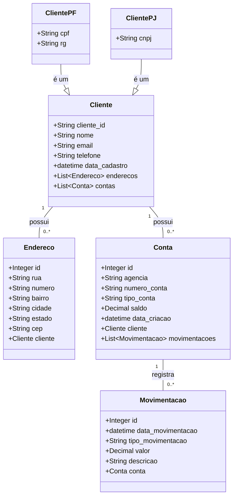

# atividade-xpto
<h2>Projeto API REST para gerenciamento de clientes, contas e movimentações bancárias</h2>

Este projeto consiste em uma API REST desenvolvida em Java com Spring Boot, que permite o gerenciamento de clientes, suas contas bancárias, endereços e as movimentações financeiras associadas. 
A API oferece funcionalidades para criar, ler, atualizar e deletar informações relacionadas a clientes, contas, endereços e movimentações.

<h3>Depedências utilizadas no projeto</h3>
<ul>
<li>Spring JPA -> Conexão com banco de dados, mapeamento de tabelas e entidades</li>
<li>Lombok -> Anotações para facilitar declaração de métodos</li>
<li>Mapstruct -> Conversão de entidades concretas para entidades dto</li>
<li>Spring Web -> Rest apis</li>
<li>H2 Database -> Banco de dados em memória</li>
<li>Postgre sql -> Banco de dados</li>
<li>Spring boot validation -> Validar inserções com anotações</li>
<li>Springdoc openapi -> documentação interativa da API</li>
</ul>

<h3>Acesse a documentação e teste os Endpoints</h3>

http://localhost:8080/swagger-ui/index.html

## Como executar o projeto

Para executar o projeto, siga os passos abaixo:

<ol>
<li>Clone o repositório para sua máquina local.</li>
<li>Certifique-se de ter o Java Development Kit (JDK) - 21 instalado.</li>
<li>Abra o projeto em sua IDE (Eclipse, IntelliJ, etc.).</li>
<li>Configure o banco de dados no arquivo application.propperties (H2 ou PostgreSQL).</li>
<li>Execute a classe principal que contém o método main para iniciar a aplicação Spring Boot.</li>
<li>Acesse a documentação da API em http://localhost:8080/swagger-ui/index.html para testar os endpoints.(Ou softwares de teste como postman)</li>
</ol>

<h3>Diagrama de Classes<h3>

