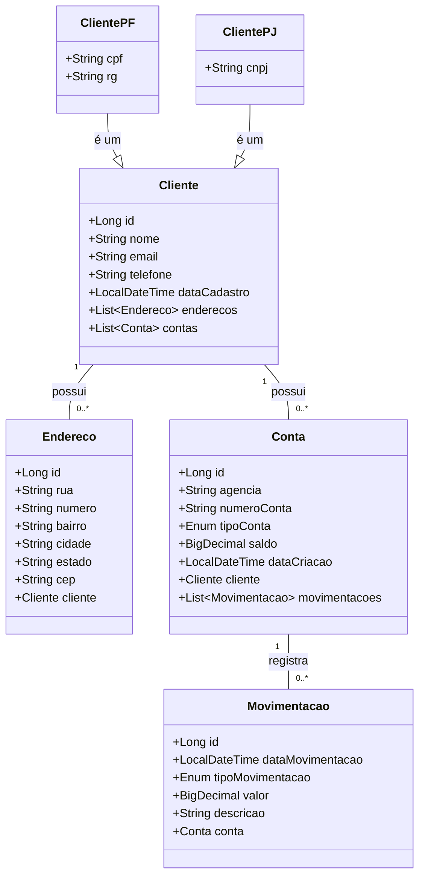

# atividade-xpto
<h2>Projeto API REST para gerenciamento de clientes, contas e movimentações bancárias</h2>

Este projeto consiste em uma API REST desenvolvida em Java com Spring Boot, que permite o gerenciamento de clientes, suas contas bancárias, endereços e as movimentações financeiras associadas. 
A API oferece funcionalidades para criar, ler, atualizar e deletar informações relacionadas a clientes, contas, endereços e movimentações.

<h3>Boas Práticas de Desenvolvimento Aplicadas</h3>

No desenvolvimento desta API REST com Java e Spring Boot, foram adotadas diversas boas práticas da engenharia de software para garantir um código limpo, manutenível, escalável e de fácil compreensão.

1. Arquitetura em Camadas (Layered Architecture): O projeto é claramente segmentado em camadas, como evidenciado pela estrutura de pacotes:

    1.1 controller: Camada de Apresentação (Web), responsável por receber requisições HTTP, delegar para a camada de serviço e retornar as respostas (JSON).

    1.2 service: Camada de Negócio, onde reside a lógica de negócios da aplicação. Ela coordena o acesso aos repositórios e executa as regras de domínio.

    1.3 repository: Camada de Acesso a Dados, responsável pela comunicação com o banco de dados, abstraindo a persistência dos dados.

    1.4 core: Pacote que centraliza componentes transversais, como models (entidades de domínio), dtos e mappers.

    1.5 infra: Camada que recebe Exception handlers.

2. Separação de Responsabilidades (Separation of Concerns - SoC): Além da separação por camadas, o projeto utiliza uma organização por features (ou domínios) dentro de cada camada (ex: clientes, conta, endereco). Isso segue o princípio da Responsabilidade Única (SRP), tornando mais fácil localizar o código referente a uma funcionalidade específica e reduzindo o acoplamento.

3. Injeção de Dependência (Dependency Injection - DI): Utilizando o container de Inversão de Controle (IoC) do Spring, as dependências são injetadas (ex: um Service é injetado no Controller, um Repository é injetado no Service) em vez de serem criadas manualmente. Isso promove o baixo acoplamento e facilita a testabilidade (permitindo o uso de mocks).

4. Uso de DTOs (Data Transfer Objects): A presença do pacote core/dtos indica o uso do padrão DTO. Esta é uma excelente prática por desacoplar a representação dos dados da API (o "contrato" com o cliente) da estrutura interna do banco de dados (models ou Entidades). Isso previne a exposição de dados sensíveis e otimiza os payloads de requisição e resposta.

5. Mapeamento de Objetos (Object Mapping): O pacote core/mappers sugere a existência de uma lógica dedicada para converter Entidades (models) em DTOs e vice-versa. Seja manualmente ou com bibliotecas (como MapStruct ou ModelMapper), isso centraliza a lógica de conversão, mantendo os Services e Controllers mais limpos.

6. Gerenciamento Centralizado de Exceções: O pacote exception aponta para a criação de um mecanismo centralizado de tratamento de erros (provavelmente usando @ControllerAdvice e @ExceptionHandler do Spring). Isso evita blocos try-catch repetitivos nos controllers e garante que a API retorne respostas de erro padronizadas e significativas para o cliente (ex: 404 Not Found, 400 Bad Request).

7. Programação Orientada a Objetos (POO): Conceitos fundamentais de POO, como Encapsulamento (protegendo os dados internos dos models), Abstração (uso de interfaces nos services e repositories) e Polimorfismo, são a base do design, permitindo um código mais modular e reutilizável.

<h3>Padrões de Projeto (Design Patterns) Utilizados</h3>

1. MVC (Model-View-Controller): Embora o usuário tenha mencionado MVC, em uma API REST, este padrão é adaptado:

    1.1 Model: As classes em core/models (Entidades JPA) e, em certo nível, os core/dtos.

    1.2 View: A representação dos dados retornada ao cliente, tipicamente em formato JSON.

    1.3 Controller: As classes em controller (anotadas com @RestController), que gerenciam o fluxo de requisição e resposta.

2. Camada de Serviço (Service Layer): Este padrão arquitetural é implementado pelo pacote service. Ele encapsula a lógica de negócios da aplicação, agindo como um intermediário entre os controllers (que não devem conter lógica de negócio) e os repositories.

3. Repositório (Repository Pattern): Implementado pelo pacote repository, este padrão abstrai a lógica de acesso e persistência de dados. O Spring Data JPA facilita enormemente esse padrão, permitindo criar interfaces que proveem operações de CRUD (Create, Read, Update, Delete) sem a necessidade de escrever implementações SQL complexas.

4. DTO (Data Transfer Object): Como mencionado nas boas práticas, DTO é um padrão de projeto que visa reduzir o número de chamadas de rede (em sistemas distribuídos) ou, neste contexto, desacoplar as camadas da aplicação, transferindo apenas os dados necessários entre elas.

5. Singleton (GoF): Por padrão, todos os beans gerenciados pelo Spring (@Service, @Repository, @RestController, @Component) são instanciados como Singletons. O container Spring garante que exista apenas uma instância desses componentes em toda a aplicação, gerenciando seu ciclo de vida.

6. Mapper (Padrão de Mapeamento): Indicado pelo pacote core/mappers, este padrão é focado em transferir dados de um objeto para outro (ex: Entidade para DTO), isolando essa responsabilidade de outras lógicas.

<h3>Depedências utilizadas no projeto</h3>
<ul>
<li>Spring JPA -> Conexão com banco de dados, mapeamento de tabelas e entidades</li>
<li>Lombok -> Anotações para facilitar declaração de métodos</li>
<li>Mapstruct -> Conversão de entidades concretas para entidades dto</li>
<li>Spring Web -> Rest apis</li>
<li>H2 Database -> Banco de dados em memória</li>
<li>Postgre sql -> Banco de dados</li>
<li>Spring boot validation -> Validar inserções com anotações</li>
<li>Springdoc openapi -> documentação interativa da API</li>
</ul>

<h3>Acesse a documentação e teste os Endpoints</h3>

http://localhost:8080/swagger-ui/index.html

## Como executar o projeto

Para executar o projeto, siga os passos abaixo:

<ol>
<li>Clone o repositório para sua máquina local.</li>
<li>Certifique-se de ter o Java Development Kit (JDK) - 21 instalado.</li>
<li>Abra o projeto em sua IDE (Eclipse, IntelliJ, etc.).</li>
<li>Configure o banco de dados no arquivo application.propperties (H2 ou PostgreSQL).</li>
<li>Execute a classe principal que contém o método main para iniciar a aplicação Spring Boot.(Talvez seja necessário executar o comando <strong>mvn clean</strong> no terminal caso dê erro)</li>
<li>Acesse a documentação da API em http://localhost:8080/swagger-ui/index.html para testar os endpoints(Ou softwares de teste como postman).</li>
</ol>

<h3>Diagrama de Classes<h3>

<h3>Tabela de endpoints e suas funcionalidades</h3>

<table>
  <thead>
    <tr>
      <th>Controller</th>
      <th>Endpoint</th>
      <th>Método HTTP</th>
      <th>Função</th>
    </tr>
  </thead>
  <tbody>
    <tr>
        <td>EnderecoController</td>
        <td>/enderecos/{id}</td>
        <td>GET</td>
        <td>Buscar endereço pelo ID</td>
        </tr>
    <tr>
        <td>EnderecoController</td>
        <td>/enderecos/{id}</td>
        <td>PUT</td>
        <td>Atualizar um endereço existente</td>
    </tr>
    <tr>
        <td>EnderecoController</td>
        <td>/enderecos/{id}</td>
        <td>DELETE</td>
        <td>Excluir um endereço pelo ID</td>
    </tr>
    <tr>
        <td>EnderecoController</td>
        <td>/enderecos</td><td>GET</td>
        <td>Listar todos os endereços cadastrados</td>
    </tr>
    <tr>
        <td>EnderecoController</td>
        <td>/enderecos</td>
        <td>POST</td>
        <td>Cadastrar um novo endereço</td>
    </tr>
    <tr>
        <td>ContaController</td>
        <td>/contas/{id}</td>
        <td>GET</td><td>Buscar conta pelo ID</td>
    </tr>
    <tr>
        <td>ContaController</td>
        <td>/contas/{id}</td>
        <td>PUT</td>
        <td>Atualizar uma conta existente</td>
    </tr>
    <tr>
        <td>ContaController</td>
        <td>/contas</td>
        <td>GET</td>
        <td>Listar todas as contas cadastradas</td>
    </tr>
    <tr>
        <td>ContaController</td>
        <td>/contas</td>
        <td>POST</td>
        <td>Cadastrar uma nova conta</td>
    </tr>
    <tr>
        <td>ClientePJController</td>
        <td>/clientes-pj/{cnpj}</td>
        <td>GET</td>
        <td>Buscar cliente PJ pelo CNPJ</td>
    </tr>
    <tr>
        <td>ClientePJController</td>
        <td>/clientes-pj/{cnpj}</td>
        <td>PUT</td>
        <td>Atualizar dados de um cliente PJ</td>
    </tr>
    <tr>
        <td>ClientePJController</td>
        <td>/clientes-pj/{cnpj}</td>
        <td>DELETE</td>
        <td>Excluir cliente PJ pelo CNPJ</td>
    </tr>
    <tr>
        <td>ClientePJController</td>
        <td>/clientes-pj</td>
        <td>GET</td>
        <td>Listar todos os clientes PJ cadastrados</td>
    </tr>
    <tr>
        <td>ClientePJController</td>
        <td>/clientes-pj</td>
        <td>POST</td>
        <td>Cadastrar um novo cliente PJ</td>
    </tr>
    <tr>
        <td>ClientePFController</td>
        <td>/clientes-pf/{cpf}</td>
        <td>GET</td>
        <td>Buscar cliente PF pelo CPF</td>
    </tr>
    <tr>
        <td>ClientePFController</td>
        <td>/clientes-pf/{cpf}</td>
        <td>PUT</td>
        <td>Atualizar dados de um cliente PF</td>
    </tr>
    <tr>
        <td>ClientePFController</td>
        <td>/clientes-pf/{cpf}</td>
        <td>DELETE</td>
        <td>Excluir cliente PF pelo CPF</td>
    </tr>
    <tr>
        <td>ClientePFController</td>
        <td>/clientes-pf</td>
        <td>GET</td>
        <td>Listar todos os clientes PF cadastrados</td>
    </tr>
    <tr>
        <td>ClientePFController</td>
        <td>/clientes-pf</td>
        <td>POST</td>
        <td>Cadastrar um novo cliente PF</td>
    </tr>
    <tr>
        <td>MovimentacaoController</td>
        <td>/movimentacoes</td>
        <td>GET</td>
        <td>Listar todas as movimentações registradas</td>
    </tr>
    <tr>
        <td>MovimentacaoController</td>
        <td>/movimentacoes</td>
        <td>POST</td>
        <td>Cadastrar uma nova movimentação financeira</td>
    </tr>
    <tr>
        <td>MovimentacaoController</td>
        <td>/movimentacoes/{id}</td>
        <td>GET</td>
        <td>Buscar movimentação pelo ID</td>
    </tr>
    <tr>
        <td>RelatorioController</td>
        <td>/relatorios/saldo/{clienteId}</td>
        <td>GET</td>
        <td>Gerar relatório de saldo por cliente</td>
    </tr>
    <tr>
        <td>RelatorioController</td>
        <td>/relatorios/saldo/{clienteId}/periodo</td>
        <td>GET</td>
        <td>Gerar relatório de saldo por cliente e período</td>
    </tr>
    <tr>
        <td>RelatorioController</td>
        <td>/relatorios/saldo/todos</td>
        <td>GET</td>
        <td>Gerar relatório de saldo de todos os clientes</td>
    </tr>
  </tbody>
</table>

<h3>!!!Atenção!!!, ao utilizar os métodos post, não precisa declarar id, pois esse campo é gerado automaticamente</h3>

<h3>Observações necessárias:<h3>

Ao testar os endpoints, inicie pelo cadastro de clientes(tanto faz se for pj ou pf)

