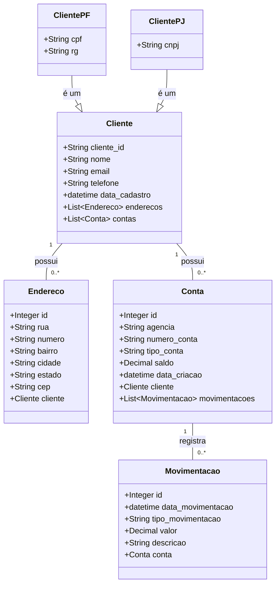

# atividade-xpto

#

<h3>Depedências utilizadas no projeto</h3>
<ul>
<li>Spring JPA -> Conexão com banco de dados, mapeamento de tabelas e entidades</li>
<li>Lombok -> Anotações para facilitar declaração de métodos</li>
<li>Mapstruct -> Conversão de entidades concretas para entidades dto</li>
<li>Spring Web -> Rest apis</li>
<li>H2 Database -> Banco de dados em memória</li>
<li>Postgre sql -> Banco de dados</li>
<li>Spring boot validation -> Validar inserções com anotações</li>
<li>Springdoc openapi -> documentação interativa da API</li>
</ul>

<h3>Acesse a documentação e teste os Endpoints</h3>

http://localhost:8080/swagger-ui/index.html

<h3>Diagrama de Classes<h3>

