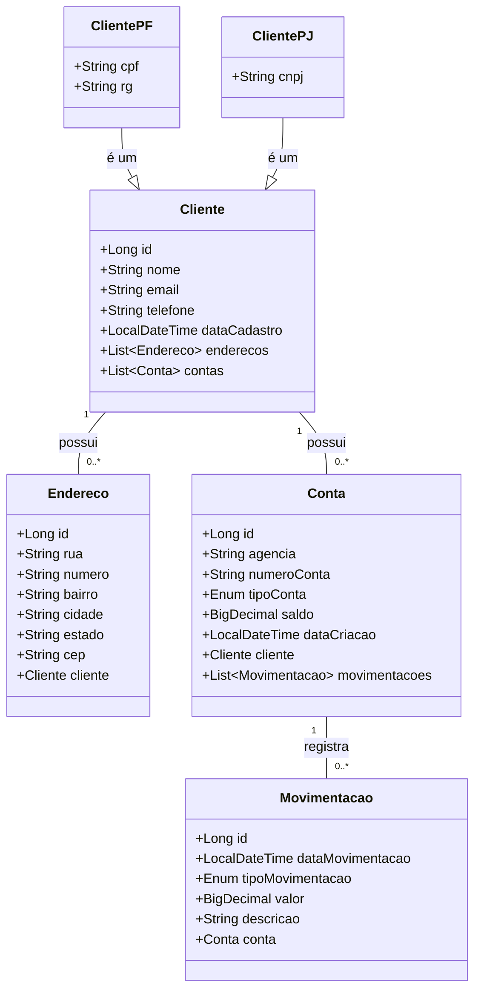

# atividade-xpto
<h2>Projeto API REST para gerenciamento de clientes, contas e movimentações bancárias</h2>

Este projeto consiste em uma API REST desenvolvida em Java com Spring Boot, que permite o gerenciamento de clientes, suas contas bancárias, endereços e as movimentações financeiras associadas. 
A API oferece funcionalidades para criar, ler, atualizar e deletar informações relacionadas a clientes, contas, endereços e movimentações.

<h3>Depedências utilizadas no projeto</h3>
<ul>
<li>Spring JPA -> Conexão com banco de dados, mapeamento de tabelas e entidades</li>
<li>Lombok -> Anotações para facilitar declaração de métodos</li>
<li>Mapstruct -> Conversão de entidades concretas para entidades dto</li>
<li>Spring Web -> Rest apis</li>
<li>H2 Database -> Banco de dados em memória</li>
<li>Postgre sql -> Banco de dados</li>
<li>Spring boot validation -> Validar inserções com anotações</li>
<li>Springdoc openapi -> documentação interativa da API</li>
</ul>

<h3>Acesse a documentação e teste os Endpoints</h3>

http://localhost:8080/swagger-ui/index.html

## Como executar o projeto

Para executar o projeto, siga os passos abaixo:

<ol>
<li>Clone o repositório para sua máquina local.</li>
<li>Certifique-se de ter o Java Development Kit (JDK) - 21 instalado.</li>
<li>Abra o projeto em sua IDE (Eclipse, IntelliJ, etc.).</li>
<li>Configure o banco de dados no arquivo application.propperties (H2 ou PostgreSQL).</li>
<li>Execute a classe principal que contém o método main para iniciar a aplicação Spring Boot.(Talvez seja necessário executar o comando <strong>mvn clean</strong> no terminal caso dê erro)</li>
<li>Acesse a documentação da API em http://localhost:8080/swagger-ui/index.html para testar os endpoints(Ou softwares de teste como postman).</li>
</ol>

<h3>Diagrama de Classes<h3>

<h3>Tabela de endpoints e suas funcionalidades</h3>

<table>
  <thead>
    <tr>
      <th>Controller</th>
      <th>Endpoint</th>
      <th>Método HTTP</th>
      <th>Função</th>
    </tr>
  </thead>
  <tbody>
    <tr>
        <td>EnderecoController</td>
        <td>/enderecos/{id}</td>
        <td>GET</td>
        <td>Buscar endereço pelo ID</td>
        </tr>
    <tr>
        <td>EnderecoController</td>
        <td>/enderecos/{id}</td>
        <td>PUT</td>
        <td>Atualizar um endereço existente</td>
    </tr>
    <tr>
        <td>EnderecoController</td>
        <td>/enderecos/{id}</td>
        <td>DELETE</td>
        <td>Excluir um endereço pelo ID</td>
    </tr>
    <tr>
        <td>EnderecoController</td>
        <td>/enderecos</td><td>GET</td>
        <td>Listar todos os endereços cadastrados</td>
    </tr>
    <tr>
        <td>EnderecoController</td>
        <td>/enderecos</td>
        <td>POST</td>
        <td>Cadastrar um novo endereço</td>
    </tr>
    <tr>
        <td>ContaController</td>
        <td>/contas/{id}</td>
        <td>GET</td><td>Buscar conta pelo ID</td>
    </tr>
    <tr>
        <td>ContaController</td>
        <td>/contas/{id}</td>
        <td>PUT</td>
        <td>Atualizar uma conta existente</td>
    </tr>
    <tr>
        <td>ContaController</td>
        <td>/contas</td>
        <td>GET</td>
        <td>Listar todas as contas cadastradas</td>
    </tr>
    <tr>
        <td>ContaController</td>
        <td>/contas</td>
        <td>POST</td>
        <td>Cadastrar uma nova conta</td>
    </tr>
    <tr>
        <td>ClientePJController</td>
        <td>/clientes-pj/{cnpj}</td>
        <td>GET</td>
        <td>Buscar cliente PJ pelo CNPJ</td>
    </tr>
    <tr>
        <td>ClientePJController</td>
        <td>/clientes-pj/{cnpj}</td>
        <td>PUT</td>
        <td>Atualizar dados de um cliente PJ</td>
    </tr>
    <tr>
        <td>ClientePJController</td>
        <td>/clientes-pj/{cnpj}</td>
        <td>DELETE</td>
        <td>Excluir cliente PJ pelo CNPJ</td>
    </tr>
    <tr>
        <td>ClientePJController</td>
        <td>/clientes-pj</td>
        <td>GET</td>
        <td>Listar todos os clientes PJ cadastrados</td>
    </tr>
    <tr>
        <td>ClientePJController</td>
        <td>/clientes-pj</td>
        <td>POST</td>
        <td>Cadastrar um novo cliente PJ</td>
    </tr>
    <tr>
        <td>ClientePFController</td>
        <td>/clientes-pf/{cpf}</td>
        <td>GET</td>
        <td>Buscar cliente PF pelo CPF</td>
    </tr>
    <tr>
        <td>ClientePFController</td>
        <td>/clientes-pf/{cpf}</td>
        <td>PUT</td>
        <td>Atualizar dados de um cliente PF</td>
    </tr>
    <tr>
        <td>ClientePFController</td>
        <td>/clientes-pf/{cpf}</td>
        <td>DELETE</td>
        <td>Excluir cliente PF pelo CPF</td>
    </tr>
    <tr>
        <td>ClientePFController</td>
        <td>/clientes-pf</td>
        <td>GET</td>
        <td>Listar todos os clientes PF cadastrados</td>
    </tr>
    <tr>
        <td>ClientePFController</td>
        <td>/clientes-pf</td>
        <td>POST</td>
        <td>Cadastrar um novo cliente PF</td>
    </tr>
    <tr>
        <td>MovimentacaoController</td>
        <td>/movimentacoes</td>
        <td>GET</td>
        <td>Listar todas as movimentações registradas</td>
    </tr>
    <tr>
        <td>MovimentacaoController</td>
        <td>/movimentacoes</td>
        <td>POST</td>
        <td>Cadastrar uma nova movimentação financeira</td>
    </tr>
    <tr>
        <td>MovimentacaoController</td>
        <td>/movimentacoes/{id}</td>
        <td>GET</td>
        <td>Buscar movimentação pelo ID</td>
    </tr>
    <tr>
        <td>RelatorioController</td>
        <td>/relatorios/saldo/{clienteId}</td>
        <td>GET</td>
        <td>Gerar relatório de saldo por cliente</td>
    </tr>
  </tbody>
</table>

<h3>!!!Atenção!!!, ao utilizar os métodos post, não precisa declarar id, pois esse campo é gerado automaticamente</h3>

<h3>Observações necessárias:<h3>

Ao testar os endpoints, inicie pelo cadastro de clientes(tanto faz se for pj ou pf)

